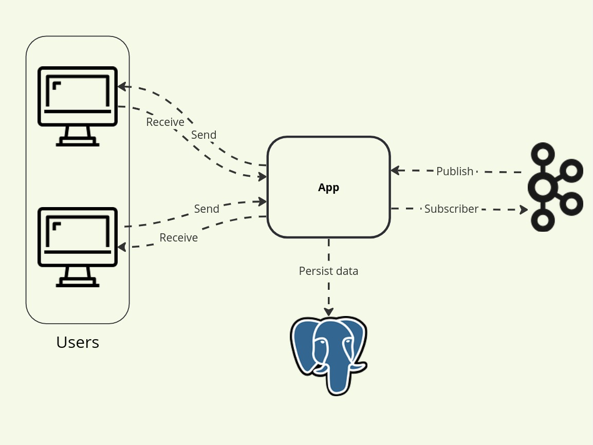

# Web Chat

This is a simple web chat application that uses websockets to communicate between clients and the server. The server is written in Golang using the fiber `websockets` library and the client is written in ReactJs using the `WebSocket` APIg.

## Architecture
<p align="center">
  
</p>


## How to run
1. Clone the repository
2. Run with docker-compose
```bash
cd docker/deployment && docker-compose up
```
3. Access the chat at `http://localhost:3000`
4. Enjoy!

## Features
- [x] Send messages
- [x] Receive messages
- [x] Show message history
- [x] Show message time
- [x] Show message author
- [ ] Show online users
- [ ] Show typing indicator
- [ ] Show message status

